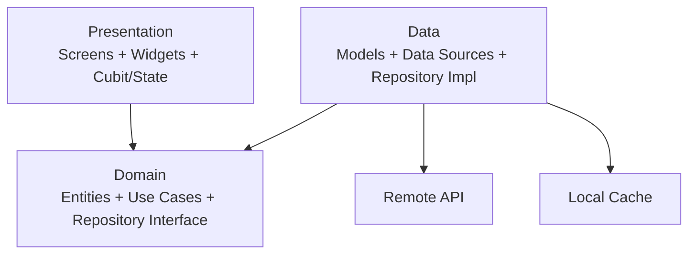
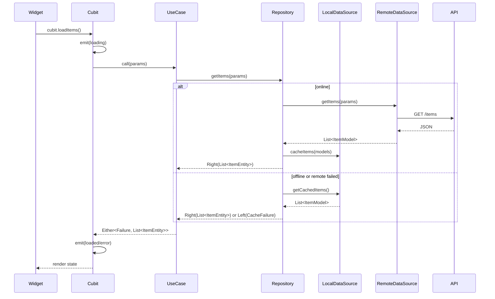
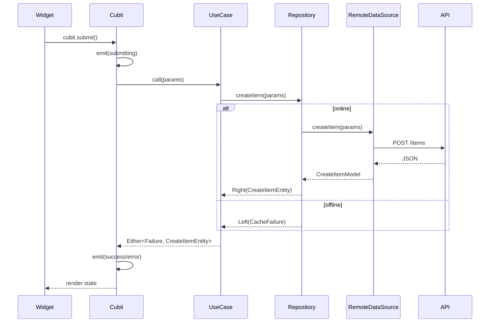

# Feature Template And Coding Standard

Use this document as a reusable standard for building any new Flutter feature with
Clean Architecture, Cubit, repository abstraction, remote/local data sources, and
thin UI composition.

This template is intentionally generic. It should not depend on one app's route
names, design-system class names, API names, service codes, or feature-specific
flows. Replace placeholder names such as `Feature`, `FeatureItem`, `ApiClient`,
`LocalCache`, `AppButton`, and `AppSpacing` with the current app's equivalents.

Rule of thumb: copy the closest existing feature, keep the architecture, then
rename and fill the real fields/API.

---

## 1. Architecture



Dependency rule:

- `presentation` depends on `domain`.
- `data` depends on `domain`.
- `domain` depends only on core/shared abstractions.
- `domain` never imports `data`, `models`, data sources, UI, cache, API client, or platform code.
- Use cases and repository interfaces return entities, never models.

---

## 2. Data Flow

### 2.1 Read With Offline Cache



Read operations should cache successful remote responses and fall back to local
data when offline. This applies to lookups, lists, details, profile data, and
other information the user can still view offline.

### 2.2 Write Online First



Do not build offline create/update/delete unless the task explicitly requires a
queued offline write flow and later sync.

---

## 3. Folder Arrangement

### 3.1 Whole `lib/`

```text
lib/
├── main.dart
├── app/                         # app root, bootstrap, app widget
├── common/                      # reusable UI widgets/helpers only
├── core/                        # app-wide infrastructure and contracts
│   ├── constants/
│   ├── error/
│   ├── extensions/
│   ├── network/
│   ├── routing/
│   ├── service_locator/
│   ├── storage/
│   ├── theme/
│   └── usecases/
├── features/                    # vertical feature slices
│   └── feature_name/
├── generated/                   # generated files, if any
└── l10n/                        # localization source files, if any
```

Rules:

- `common/` contains reusable UI components only.
- `core/` contains app-wide infrastructure only.
- Business feature code belongs under `features/<feature_name>`.
- Generated files are not edited manually.
- Avoid new root folders under `lib/` unless they are truly app-wide.

### 3.2 Per Feature

```text
lib/features/feature_name/
├── data/
│   ├── data_sources/
│   │   ├── local_data_source.dart
│   │   └── remote_data_source.dart
│   ├── models/
│   │   ├── item_model.dart
│   │   └── create_item_model.dart
│   └── repositories/
│       └── feature_repository_impl.dart
├── domain/
│   ├── entities/
│   │   ├── item_entity.dart
│   │   └── create_item_entity.dart
│   ├── repositories/
│   │   └── feature_repository.dart
│   └── use_cases/
│       ├── get_items_use_case.dart
│       └── create_item_use_case.dart
└── presentation/
    ├── cubit/
    │   ├── feature_cubit.dart
    │   └── feature_state.dart
    ├── screens/
    │   └── feature_screen.dart
    └── widgets/
        ├── item_list_section.dart
        ├── item_form_section.dart
        └── submit_actions_section.dart
```

Folder rules:

- Keep all cubits under `presentation/cubit`.
- Keep all screen sections/widgets under `presentation/widgets`.
- Keep screen files thin.
- Keep models and data sources in `data`.
- Keep entities, repository interfaces, and use cases in `domain`.
- Domain must not import models or data sources.

---

## 4. Use This, Never That

| Area | Use This | Never That |
|---|---|---|
| Domain boundary | Entities from use cases/repositories | Returning models from domain |
| Domain imports | Core/shared abstractions only | Data sources, models, cache, API client, UI |
| Entity shape | Immutable fields + value equality | JSON methods or API parsing in entities |
| Model mapping | `ItemModel.fromJson`, `toJson`, `toJsonFromEntity` | `(item as ItemModel).toJson()` |
| UI responsibility | Read state and call cubit methods | Business/API/cache logic in widgets |
| State | Cubit/State for changing data | Stateful widgets for business state |
| Screen structure | Thin screen plus section widgets | One huge screen file |
| Section widgets | Public `StatelessWidget`s where possible | Large private inline widgets |
| Styling | App design tokens/components | Raw colors, raw sizes, random text styles |
| Strings | Localization/app string system | Hardcoded user-facing strings |
| Spacing | App spacing widget/token, for example `const Sizer(height: 8)` when that is the app standard | Empty `SizedBox`, mixed spacing systems, `.w`/`.h` inside spacing widgets |
| Loading/error | Existing state/failure/UI pattern | One-off loaders/errors per screen |
| Diagnostics | Failure/state/logging pattern | Debug `print` / temporary `debugPrint` |
| Analyzer | Fix issues until clean | Ignored errors, warnings, or hints |
| Comments | Useful comments explaining current behavior | Old commented-out code or stale TODO/debug comments |

---

## 5. Presentation Standard

### 5.1 UI Calls Cubit Only

Widgets should:

- Render state.
- Show user-facing UI.
- Call cubit methods or simple cubit setters.
- Use localized strings.
- Use the app design system.

Widgets should not:

- Call API clients.
- Call repositories directly.
- Read/write cache directly.
- Parse JSON.
- Convert models.
- Decide business rules.

### 5.2 Cubit Owns Changing Logic

Cubits own:

- Loading flows.
- Validation decisions.
- Create/update/delete actions.
- Mapping selected labels back to IDs.
- Text/input controllers when the app uses controllers.
- Calling use cases.
- Emitting state transitions.

### 5.3 Split Screens Into Sections

The main screen should read like a table of contents.

```dart
class FeatureScreen extends StatelessWidget {
  const FeatureScreen({super.key});

  @override
  Widget build(BuildContext context) {
    return BlocProvider(
      create: (_) => getIt<FeatureCubit>()..loadItems(),
      child: const FeatureView(),
    );
  }
}

class FeatureView extends StatelessWidget {
  const FeatureView({super.key});

  @override
  Widget build(BuildContext context) {
    return Scaffold(
      appBar: AppBar(title: Text(context.strings.featureTitle)),
      body: const SingleChildScrollView(
        child: Column(
          children: [
            ItemListSection(),
            ItemFormSection(),
            SubmitActionsSection(),
          ],
        ),
      ),
    );
  }
}
```

Each major section gets its own file in `presentation/widgets/`.
Prefer `StatelessWidget` and `const` constructors whenever possible.

---

## 6. Domain Template

### 6.1 Entity

```dart
import 'package:equatable/equatable.dart';

class ItemEntity extends Equatable {
  final int id;
  final String title;
  final String? description;

  const ItemEntity({
    required this.id,
    required this.title,
    this.description,
  });

  @override
  List<Object?> get props => [id, title, description];
}
```

Entities:

- Are immutable.
- Extend or implement value equality.
- Contain no JSON methods.
- Contain no API/cache/UI dependencies.

### 6.2 Repository Interface

```dart
import 'package:dartz/dartz.dart';

abstract class FeatureRepository {
  Future<Either<Failure, List<ItemEntity>>> getItems({
    required GetItemsParams params,
  });

  Future<Either<Failure, CreateItemEntity>> createItem({
    required CreateItemParams params,
  });
}
```

### 6.3 Use Case

```dart
class GetItemsUseCase {
  final FeatureRepository repository;

  const GetItemsUseCase(this.repository);

  Future<Either<Failure, List<ItemEntity>>> call({
    required GetItemsParams params,
  }) {
    return repository.getItems(params: params);
  }
}
```

### 6.4 Params

```dart
class CreateItemParams {
  final String title;
  final String? description;

  const CreateItemParams({
    required this.title,
    this.description,
  });

  Map<String, dynamic> toMap() {
    return {
      'title': title,
      'description': description,
    };
  }
}
```

Params may expose `toMap()` when the request body is owned by the domain use
case contract. Keep API-only conversion details in the data layer.

---

## 7. Data Template

### 7.1 Model

```dart
class ItemModel extends ItemEntity {
  const ItemModel({
    required super.id,
    required super.title,
    super.description,
  });

  factory ItemModel.fromJson(Map<String, dynamic> json) {
    return ItemModel(
      id: json['id'] as int,
      title: json['title'] as String,
      description: json['description'] as String?,
    );
  }

  Map<String, dynamic> toJson() {
    return toJsonFromEntity(this);
  }

  static Map<String, dynamic> toJsonFromEntity(ItemEntity entity) {
    return {
      'id': entity.id,
      'title': entity.title,
      'description': entity.description,
    };
  }
}
```

Models:

- Live in the data layer.
- Parse API/cache JSON.
- Serialize API/cache payloads.
- May extend entities when that is the app convention.
- Must not be returned by domain repository interfaces/use cases.

Avoid unsafe serialization casts:

```dart
// Avoid
(item as ItemModel).toJson();

// Prefer
ItemModel.toJsonFromEntity(item);
```

### 7.2 Remote Data Source

```dart
abstract class FeatureRemoteDataSource {
  Future<List<ItemModel>> getItems(GetItemsParams params);
  Future<CreateItemModel> createItem(CreateItemParams params);
}

class FeatureRemoteDataSourceImpl implements FeatureRemoteDataSource {
  final ApiClient apiClient;

  const FeatureRemoteDataSourceImpl(this.apiClient);

  @override
  Future<List<ItemModel>> getItems(GetItemsParams params) async {
    final response = await apiClient.get('/items', query: params.toMap());
    final data = response is List ? response : response['data'] as List;

    return data
        .map((item) => ItemModel.fromJson(item as Map<String, dynamic>))
        .toList();
  }

  @override
  Future<CreateItemModel> createItem(CreateItemParams params) async {
    final response = await apiClient.post('/items', body: params.toMap());
    return CreateItemModel.fromJson(response as Map<String, dynamic>);
  }
}
```

Remote data sources:

- Call APIs only.
- Return models only.
- Do not return entities directly.
- Do not know about UI state.

### 7.3 Local Data Source

```dart
abstract class FeatureLocalDataSource {
  Future<void> cacheItems(List<ItemModel> items);
  Future<List<ItemModel>> getCachedItems();
}

class FeatureLocalDataSourceImpl implements FeatureLocalDataSource {
  final LocalCache cache;

  const FeatureLocalDataSourceImpl(this.cache);

  @override
  Future<void> cacheItems(List<ItemModel> items) async {
    final encoded = jsonEncode(
      items.map(ItemModel.toJsonFromEntity).toList(),
    );

    await cache.writeString('feature_items', encoded);
  }

  @override
  Future<List<ItemModel>> getCachedItems() async {
    final cached = await cache.readString('feature_items');

    if (cached == null || cached.isEmpty) {
      throw const CacheFailure();
    }

    final decoded = jsonDecode(cached) as List<dynamic>;

    return decoded
        .map((item) => ItemModel.fromJson(item as Map<String, dynamic>))
        .toList();
  }
}
```

Local data sources:

- Store/read models because cache is a data concern.
- Throw `CacheFailure` if no usable cached data exists.
- Do not expose cache APIs to cubits or widgets.

### 7.4 Repository Implementation

```dart
class FeatureRepositoryImpl implements FeatureRepository {
  final FeatureRemoteDataSource remote;
  final FeatureLocalDataSource local;
  final NetworkInfo networkInfo;

  const FeatureRepositoryImpl({
    required this.remote,
    required this.local,
    required this.networkInfo,
  });

  @override
  Future<Either<Failure, List<ItemEntity>>> getItems({
    required GetItemsParams params,
  }) async {
    if (await networkInfo.isConnected) {
      try {
        final remoteItems = await remote.getItems(params);
        await local.cacheItems(remoteItems);
        return Right(remoteItems);
      } on ServerFailure catch (failure) {
        final cached = await _getCachedItems();
        return cached.fold(
          (_) => Left(failure),
          (items) => Right(items),
        );
      }
    }

    return _getCachedItems();
  }

  @override
  Future<Either<Failure, CreateItemEntity>> createItem({
    required CreateItemParams params,
  }) async {
    if (!await networkInfo.isConnected) {
      return const Left(CacheFailure());
    }

    try {
      final created = await remote.createItem(params);
      return Right(created);
    } on ServerFailure catch (failure) {
      return Left(failure);
    }
  }

  Future<Either<Failure, List<ItemEntity>>> _getCachedItems() async {
    try {
      final cachedItems = await local.getCachedItems();
      return Right(cachedItems);
    } on CacheFailure catch (failure) {
      return Left(failure);
    }
  }
}
```

Repository rules:

- Repository is the only place that decides remote vs local.
- Successful read responses should be cached.
- Offline reads should fall back to cache.
- Remote read failures may fall back to cache when useful.
- Writes stay online-only unless queued offline sync is explicitly required.
- Domain receives entities, even if the implementation internally uses models.

---

## 8. Cubit Template

```dart
part 'feature_state.dart';

class FeatureCubit extends Cubit<FeatureState> {
  final GetItemsUseCase getItemsUseCase;
  final CreateItemUseCase createItemUseCase;

  FeatureCubit({
    required this.getItemsUseCase,
    required this.createItemUseCase,
  }) : super(const FeatureState());

  Future<void> loadItems() async {
    emit(state.copyWith(status: FeatureStatus.loading));

    final result = await getItemsUseCase(
      params: const GetItemsParams(),
    );

    result.fold(
      (failure) => emit(state.copyWith(
        status: FeatureStatus.error,
        errorMessage: failure.message,
      )),
      (items) => emit(state.copyWith(
        status: FeatureStatus.loaded,
        items: items,
      )),
    );
  }

  Future<void> submit(CreateItemParams params) async {
    emit(state.copyWith(status: FeatureStatus.submitting));

    final result = await createItemUseCase(params: params);

    result.fold(
      (failure) => emit(state.copyWith(
        status: FeatureStatus.submitError,
        errorMessage: failure.message,
      )),
      (created) => emit(state.copyWith(
        status: FeatureStatus.submitSuccess,
        createdItem: created,
      )),
    );
  }
}
```

State example:

```dart
part of 'feature_cubit.dart';

enum FeatureStatus {
  initial,
  loading,
  loaded,
  error,
  submitting,
  submitSuccess,
  submitError,
}

extension FeatureStatusX on FeatureState {
  bool get isLoading => status == FeatureStatus.loading;
  bool get isLoaded => status == FeatureStatus.loaded;
  bool get isError => status == FeatureStatus.error;
  bool get isSubmitting => status == FeatureStatus.submitting;
  bool get isSubmitSuccess => status == FeatureStatus.submitSuccess;
  bool get isSubmitError => status == FeatureStatus.submitError;
}

class FeatureState extends Equatable {
  final FeatureStatus status;
  final List<ItemEntity> items;
  final CreateItemEntity? createdItem;
  final String? errorMessage;

  const FeatureState({
    this.status = FeatureStatus.initial,
    this.items = const [],
    this.createdItem,
    this.errorMessage,
  });

  FeatureState copyWith({
    FeatureStatus? status,
    List<ItemEntity>? items,
    CreateItemEntity? createdItem,
    String? errorMessage,
  }) {
    return FeatureState(
      status: status ?? this.status,
      items: items ?? this.items,
      createdItem: createdItem ?? this.createdItem,
      errorMessage: errorMessage ?? this.errorMessage,
    );
  }

  @override
  List<Object?> get props => [status, items, createdItem, errorMessage];
}
```

---

## 9. Dependency Injection

Register abstractions, not concrete classes at call sites.

```dart
void registerFeatureDependencies(ServiceLocator sl) {
  sl.registerLazySingleton<FeatureRemoteDataSource>(
    () => FeatureRemoteDataSourceImpl(sl()),
  );

  sl.registerLazySingleton<FeatureLocalDataSource>(
    () => FeatureLocalDataSourceImpl(sl()),
  );

  sl.registerLazySingleton<FeatureRepository>(
    () => FeatureRepositoryImpl(
      remote: sl(),
      local: sl(),
      networkInfo: sl(),
    ),
  );

  sl.registerLazySingleton(
    () => GetItemsUseCase(sl()),
  );

  sl.registerLazySingleton(
    () => CreateItemUseCase(sl()),
  );

  sl.registerFactory(
    () => FeatureCubit(
      getItemsUseCase: sl(),
      createItemUseCase: sl(),
    ),
  );
}
```

General DI rules:

- Data sources: lazy singletons.
- Repositories: lazy singletons.
- Use cases: lazy singletons.
- Cubits: factories, unless the app intentionally needs a long-lived cubit.

---

## 10. UI And Design System

Use the current app's design system. The exact class names differ between apps,
but the rules should stay the same:

- Use color tokens instead of raw colors.
- Use spacing/radius/size tokens instead of random numbers.
- Use the app spacing widget/token for empty gaps. If the project standard is
  `Sizer`, use `const Sizer(height: 8)` or `const Sizer(width: 8)`.
- Do not pass screen-util extensions, size tokens, or infinite values into a
  spacing widget unless that widget explicitly supports them.
- Use localized strings for user-facing text.
- Use theme text styles plus small overrides instead of raw `TextStyle` everywhere.
- Prefer `const` widgets whenever possible.
- Prefer stateless section widgets.
- Do not put UI cards inside UI cards unless the design system expects it.

Generic spacing example:

```dart
const AppSpacing.vertical(16);
const AppSpacing.horizontal(8);
```

If the app does not have a spacing widget, use its existing spacing convention
consistently. Do not mix multiple spacing systems in the same feature.

---

## 11. Code Quality Rules

Fix issues instead of hiding them.

- Do not leave analyzer errors, warnings, or avoidable hints.
- Do not add `// ignore:` or `// ignore_for_file:` unless there is a real
  documented reason and the team accepts it.
- Do not leave debug-only `print` or temporary `debugPrint`.
- Do not leave old commented-out code blocks.
- Do not leave stale TODO/debug comments.
- Run format and analyzer before finishing.
- If a verification search still matches, explain exactly why the match is acceptable.

---

## 12. No API Yet

If the UI is being built before the API is ready, still build the same domain
contract. Do not put dummy lists inside widgets or cubits.

Use this dependency chain:

```text
Widget -> Cubit -> UseCase -> Repository interface -> DummyRepository
```

Dummy repository example:

```dart
class FeatureDummyRepository implements FeatureRepository {
  @override
  Future<Either<Failure, List<ItemEntity>>> getItems({
    required GetItemsParams params,
  }) async {
    return const Right([
      ItemEntity(id: 1, title: 'Option 1'),
      ItemEntity(id: 2, title: 'Option 2'),
    ]);
  }

  @override
  Future<Either<Failure, CreateItemEntity>> createItem({
    required CreateItemParams params,
  }) async {
    return const Right(CreateItemEntity(id: 1, message: 'Created'));
  }
}
```

When the API is ready, keep these stable:

- Entity fields unless app-facing requirements changed.
- Repository interface return types.
- Use case return types.
- Cubit public methods and state shape.
- UI widgets.

Usually only these should change:

- Endpoint constants.
- Remote data source.
- Model `fromJson` / `toJson`.
- Repository implementation.
- DI registration from dummy repository to real repository.

---

## 13. Checks Before Finishing

- [ ] Domain imports no data/model/data-source/UI code.
- [ ] Use cases and repository interfaces return entities, not models.
- [ ] Entities have no JSON methods.
- [ ] Models own `fromJson`, `toJson`, and `toJsonFromEntity`.
- [ ] No unsafe `(x as SomeModel).toJson()` serialization.
- [ ] Repository handles remote/local decisions.
- [ ] Read methods cache successful remote responses.
- [ ] Read methods fall back to local cache when offline.
- [ ] Read methods may fall back to local cache when remote fails.
- [ ] Cache keys are added for every cached payload.
- [ ] Write methods are online-only unless offline sync is explicitly required.
- [ ] Cubits own changing logic and use-case calls.
- [ ] UI only reads state and calls cubit methods.
- [ ] Main screen is thin and split into section widgets.
- [ ] Section widgets are public `StatelessWidget`s where possible.
- [ ] User-facing text is localized.
- [ ] Design-system tokens/components are used consistently.
- [ ] Empty spacing uses the app spacing widget/token consistently.
- [ ] If the app standard is `Sizer`, spacing uses `const Sizer(height: 8)` or `const Sizer(width: 8)`.
- [ ] No debug-only `print` or temporary `debugPrint`.
- [ ] No old commented-out code blocks.
- [ ] No unjustified `// ignore:` or `// ignore_for_file:` comments.
- [ ] Analyzer has no errors, warnings, or avoidable hints.
- [ ] Changed Dart files are formatted.

Recommended verification commands:

```bash
rg -n "import .*data/(model|models|data_sources)|Model\b" lib/features/*/domain
rg -n "Future<.*Model|Either<Failure, .*Model|List<.*Model|Model>" lib/features/*/domain
rg -n "as [A-Za-z0-9_]+Model\??\)\?*\.toJson\(|as [A-Za-z0-9_]+Model\??\)" lib
rg -n "\bprint\(|debugPrint\(" lib
rg -n "^\s*//\s*(ignore:|ignore_for_file:|TODO|print|debugPrint)" lib
dart format <changed dart files>
flutter analyze --no-fatal-infos --no-fatal-warnings
```

Report any remaining search matches and why they are acceptable.
