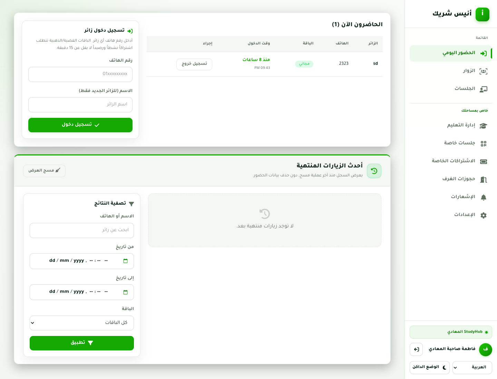
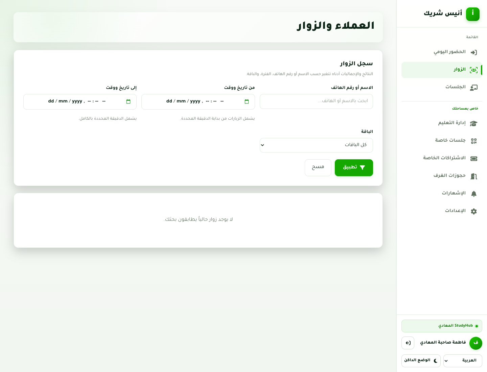
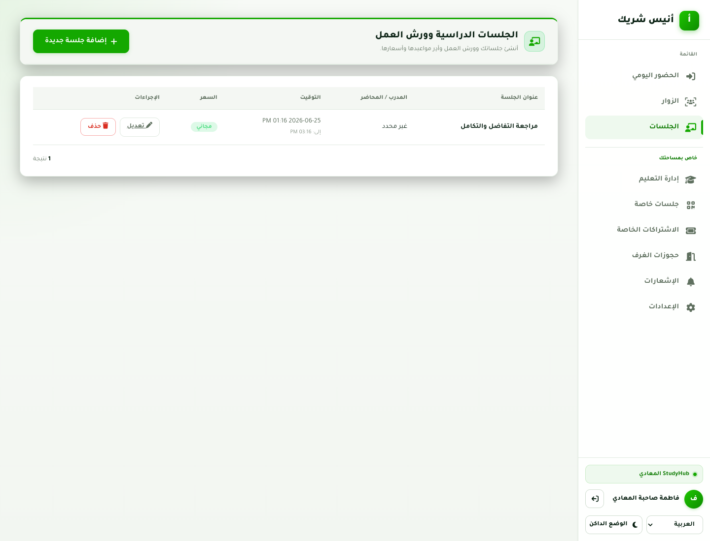
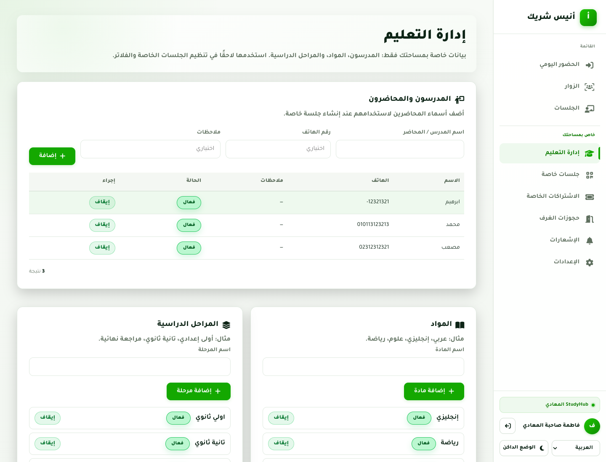
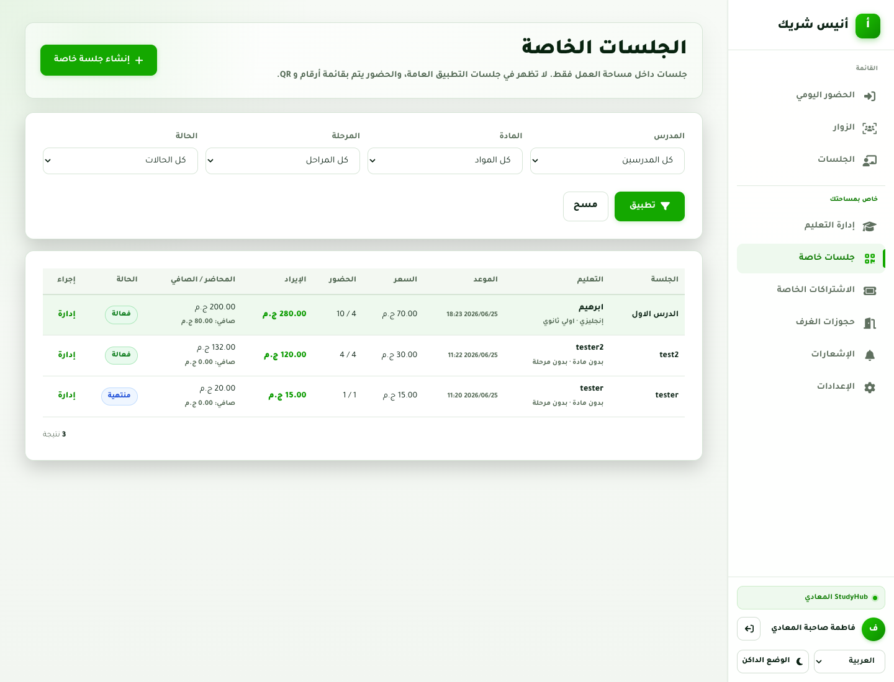
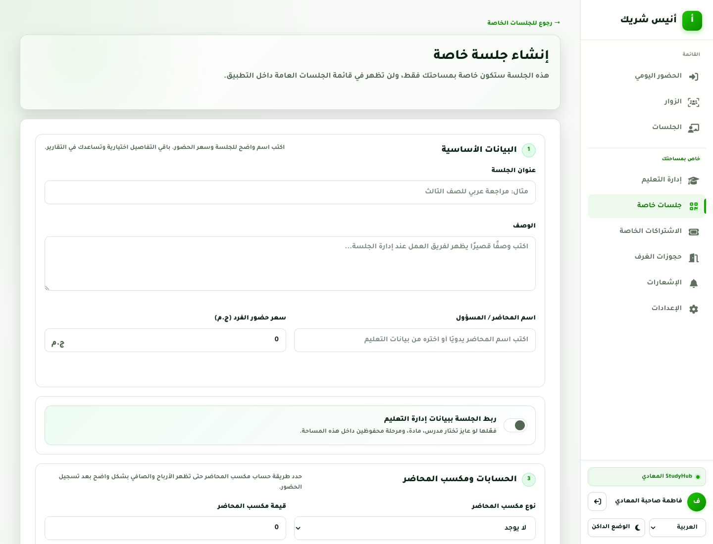
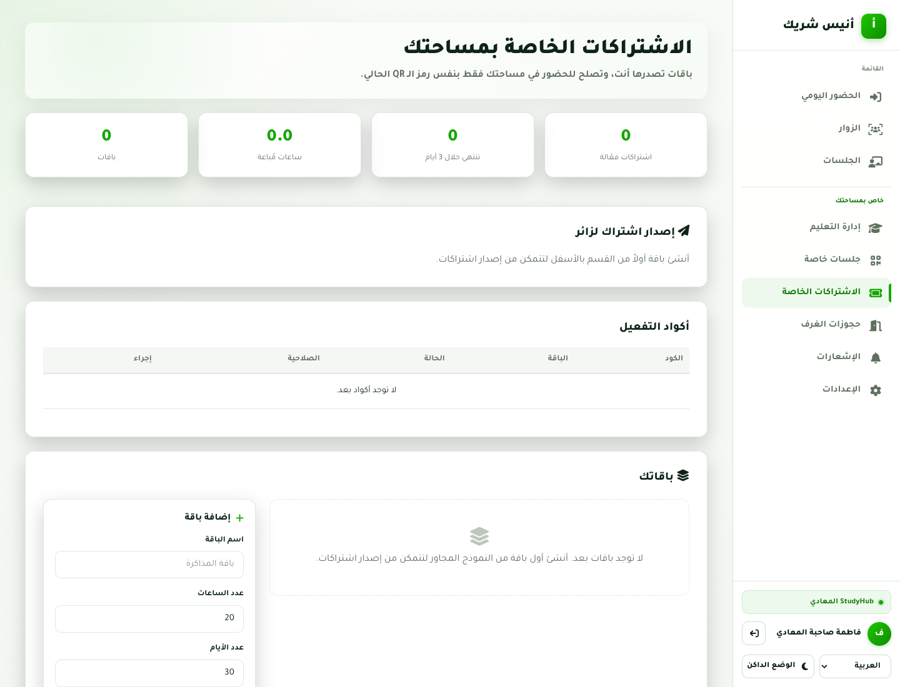
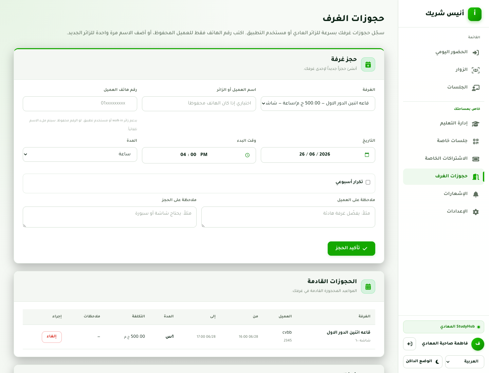
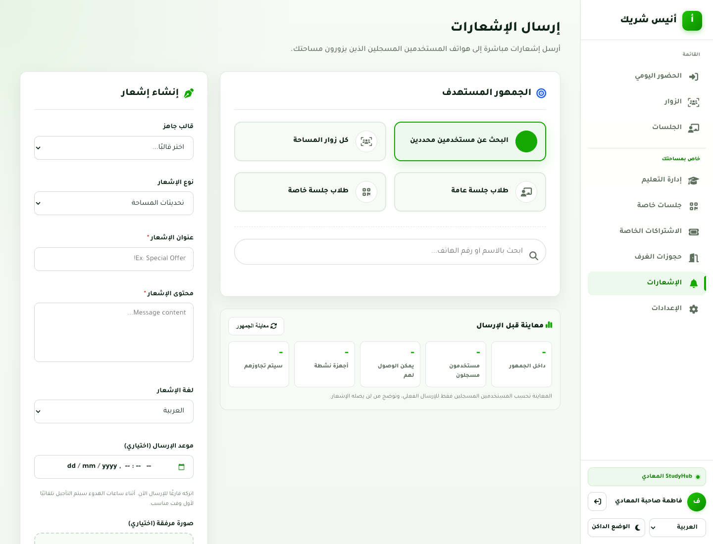
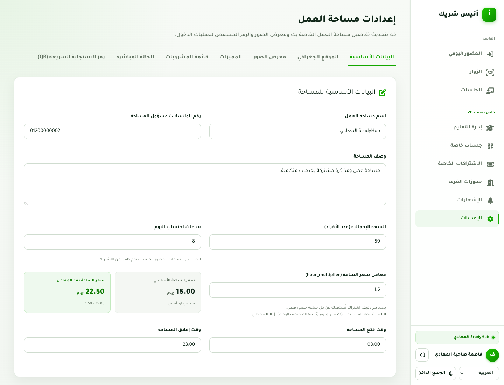

# Çalışma Alanı Sahibi Paneli Hızlı Kullanım Rehberi

Bu rehber basit tutulmuştur. Her bölüm sayfanın amacını, ne zaman kullanılacağını ve temel adımları açıklar.

## Hızlı Başlangıç

1. Çalışma alanı sahibi portalını açın.
2. Telefon numarası ve şifre ile giriş yapın.
3. Sayfalar arasında geçmek için yan menüyü kullanın.
4. Genel sayfalar önce gelir: **Günlük Yoklama**, **Ziyaretçiler**, **Oturumlar**.
5. Alanınıza özel sayfalar altta yer alır: **Eğitim Yönetimi**, **Özel Oturumlar**, **Özel Abonelikler**, **Oda Rezervasyonları**, **Bildirimler**, **Ayarlar**.

## 1. Günlük Yoklama

**Amaç:** Gün içinde ziyaretçi giriş ve çıkışlarını yönetmek.

**Bu sayfayı şunlar için kullanın:**
- Telefon ve isimle hızlı ziyaretçi girişi yapmak.
- İçeride olan ziyaretçileri görmek.
- Ziyaretçiyi çıkışa almak ve süreyi hesaplamak.
- Son tamamlanan ziyaretleri incelemek.

**Nasıl kullanılır:**
1. Telefon numarasını girin.
2. Ziyaretçi yeniyse adını girin.
3. **Giriş kaydet** seçeneğini kullanın.
4. Ziyaretçi çıktığında aktif ziyaretçiler tablosundan çıkışını kaydedin.

## 2. Ziyaretçiler

**Amaç:** Ziyaretçi geçmişini aramak ve toplamları incelemek.

**Bu sayfayı şunlar için kullanın:**
- İsim veya telefon numarası ile arama yapmak.
- Tarih veya plan ile filtrelemek.
- Ziyaret sayısı, dakika toplamı ve tahmini geliri görmek.

**Nasıl kullanılır:**
1. İsim veya telefon numarası girin.
2. Gerekirse tarih aralığı veya plan seçin.
3. **Uygula** seçeneğini kullanın.
4. Belirli bir ziyaretçi için **Geçmişi görüntüle** seçeneğini açın.

## 3. Oturumlar

**Amaç:** Mobil uygulamada görünebilen genel oturumları yönetmek.

**Bu sayfayı şunlar için kullanın:**
- Genel ders veya atölye eklemek.
- Eğitmen, zaman ve fiyat belirlemek.
- Mevcut oturumları düzenlemek veya silmek.

**Nasıl kullanılır:**
1. **Yeni oturum ekle** seçeneğini kullanın.
2. Oturum bilgilerini girin.
3. Başlangıç ve bitiş zamanını belirleyin.
4. Kaydedin ve tablodan kontrol edin.

## 4. Eğitim Yönetimi

**Amaç:** Sadece bu çalışma alanına ait öğretmen, ders ve sınıf seviyesi verilerini hazırlamak.

**Bu sayfayı şunlar için kullanın:**
- Öğretmen veya eğitmen eklemek.
- Arapça, İngilizce, Matematik gibi dersler eklemek.
- Sınıf seviyeleri eklemek.
- Bu verileri özel oturumlarda ve filtrelerde kullanmak.

**Nasıl kullanılır:**
1. Öğretmenleri ekleyin.
2. Dersleri ekleyin.
3. Sınıf seviyelerini ekleyin.
4. Bir öğeyi silmeden gizlemek için **Devre dışı bırak** seçeneğini kullanın.

## 5. Özel Oturumlar

**Amaç:** Tüm kullanıcılara açık olmayan, sadece çalışma alanına özel oturumları yönetmek.

**Bu sayfayı şunlar için kullanın:**
- Özel sınıf veya grup oluşturmak.
- Kayıtlı ve katılan ziyaretçileri takip etmek.
- Gelir ve eğitmen payını hesaplamak.
- Yönetim ve QR giriş sayfalarını açmak.

**Nasıl kullanılır:**
1. **Özel oturum oluştur** seçeneğini kullanın.
2. Oluşturduktan sonra **Yönet** seçeneğini açın.
3. Katılımcıları manuel ekleyin veya dosya içe aktarın.
4. QR ile giriş veya manuel yoklama kullanın.
5. Oturum bittiğinde **Oturumu bitir** seçeneğini kullanın.

## 6. Özel Oturum Oluşturma

**Amaç:** Özel oturumu tüm gerekli bilgilerle oluşturmak.

**Bu sayfada şunları belirlersiniz:**
- Başlık ve açıklama.
- Eğitmen veya sorumlu kişi.
- Ders ve sınıf seviyesi.
- Kişi başı fiyat.
- Eğitmen ödeme tipi ve değeri.
- Başlangıç, bitiş ve kapasite.

**Nasıl kullanılır:**
1. Başlığı girin.
2. Gerekirse kısa açıklama ekleyin.
3. Ders ise eğitim verilerini seçin.
4. Fiyatı ve eğitmen payını belirleyin.
5. Zamanı ve kapasiteyi ayarlayın.
6. **Oturum oluştur** seçeneğini kullanın.

## 7. Özel Abonelikler

**Amaç:** Çalışma alanına özel planlar oluşturmak ve ziyaretçilere abonelik vermek.

**Bu sayfayı şunlar için kullanın:**
- Saat, gün ve fiyat içeren planlar oluşturmak.
- Ziyaretçiye abonelik vermek.
- Aktif abonelikleri takip etmek.
- Gerekirse aboneliği iptal etmek.
- Aktivasyon kodlarını yönetmek.

**Nasıl kullanılır:**
1. Bir plan oluşturun.
2. Ziyaretçinin telefon numarasını seçin veya girin.
3. Aboneliği verin.
4. Kalan saat ve günleri tablodan takip edin.

## 8. Oda Rezervasyonları

**Amaç:** Odaları yönetmek ve rezervasyon çakışmalarını önlemek.

**Bu sayfayı şunlar için kullanın:**
- Oda eklemek.
- Müşteri için oda ayırmak.
- Tarih ve saat seçmek.
- Not eklemek.
- Gerekirse rezervasyonu iptal etmek.

**Nasıl kullanılır:**
1. Kullanılabilir odaları ekleyin.
2. Müşteri bilgilerini girin.
3. Oda ve zamanı seçin.
4. Rezervasyonu kaydedin.
5. Mevcut ve yaklaşan rezervasyonları kontrol edin.

## 9. Bildirimler

**Amaç:** Çalışma alanıyla ilişkili kayıtlı uygulama kullanıcılarına bildirim göndermek.

**Bu sayfayı şunlar için kullanın:**
- Tüm kayıtlı çalışma alanı ziyaretçilerine bildirim göndermek.
- Belirli kullanıcılara bildirim göndermek.
- Genel veya özel oturum katılımcılarına bildirim göndermek.
- Hazır şablon kullanmak.
- Göndermeden önce ulaşılabilir kullanıcı sayısını görmek.

**Nasıl kullanılır:**
1. Hedef kitleyi seçin.
2. Bir şablon seçin veya başlık ve mesaj yazın.
3. Bildirim dilini seçin.
4. **Kitleyi önizle** seçeneğini kullanın.
5. Sayıları kontrol edin ve **Bildirimi gönder** seçeneğini kullanın.

## 10. Ayarlar

**Amaç:** Çalışma alanı profilini, görünümünü ve çalışma ayarlarını güncellemek.

**Bu sayfayı şunlar için kullanın:**
- İsim, açıklama ve iletişim bilgilerini düzenlemek.
- Konumu güncellemek.
- Fotoğraf yüklemek.
- Hizmetleri seçmek.
- Ziyaretçi çıkış yöntemini belirlemek.
- Dil veya tema değiştirmek.

**Nasıl kullanılır:**
1. Gerekli ayar bölümünü açın.
2. Bilgileri düzenleyin.
3. Değişiklikleri kontrol edin.
4. **Tüm değişiklikleri kaydet** seçeneğini kullanın.

## Hızlı İpuçları

- Günlük işlemler için **Günlük Yoklama** sayfasını kullanın.
- Geçmiş ve raporlar için **Ziyaretçiler** sayfasını kullanın.
- İç sınıflar veya gruplar için **Özel Oturumlar** sayfasını kullanın.
- Çalışma alanı eğitim merkeziyse önce **Eğitim Yönetimi** verilerini hazırlayın.
- Bildirim göndermeden önce her zaman **Kitleyi önizle** seçeneğini kullanın.
- Oturum gerçekleştiyse **Oturumu bitir** kullanın. Oturum gerçekleşmediyse **Oturumu iptal et** kullanın.
